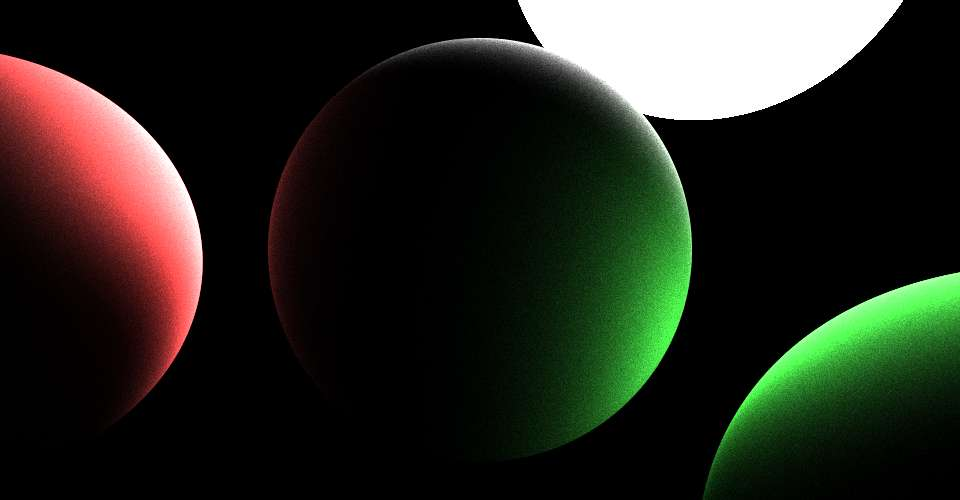

# RaytracingMin
簡易版レイトレーシング

jsonファイルから設定を読み込みレイトレーシングをして、結果を画像ファイルで保存します。

# 使い方
- [Releases](https://github.com/Penguin77jp/RaytracingMin/releases)から`RaytracingMin.exe`をダウンロード

- 実行方法は2つあります。
    - `RaytracingMin.exe`をダブルクリックで実行

    > 初回実行時に `settingData.json`ファイルが生成されます。

    - コマンドラインからの実行

    > `RaytracingMin.exe -?` で使い方を確認して下さい。

# Example

# ThirdParty
- [nlohmann/json](https://github.com/nlohmann/json)

- [nothings/stb](https://github.com/nothings/stb)

- [mmp/pbrt-v3](https://github.com/mmp/pbrt-v3)
    - [spectrum data](https://github.com/mmp/pbrt-v3/blob/master/src/core/spectrum.cpp#L984) in src/core/spectrum.cpp